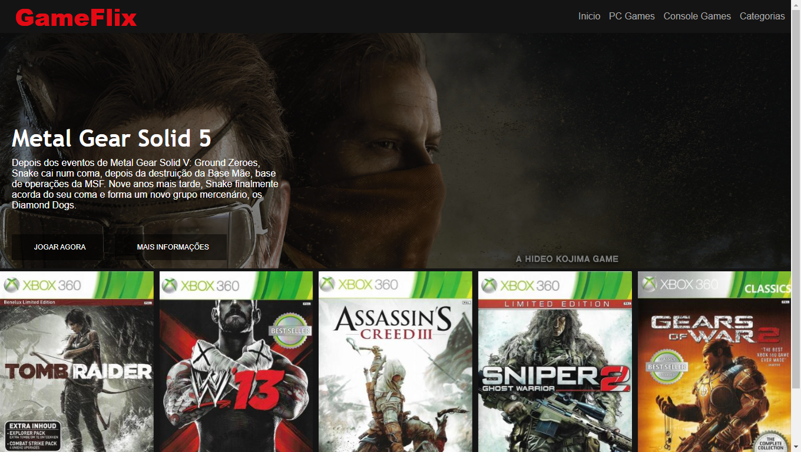

# Clone Netflix

Essa é a solução para o projeto prático do bootcamp de desenvolvimento web da Digital Innovation One!

## Table of contents

- [Overview](#overview)
  - [Screenshot](#screenshot)
  - [Links](#links)
- [My process](#my-process)
  - [Built with](#built-with)
- [Author](#author)
- [Acknowledgments](#acknowledgments)

## Overview

### Screenshot

Aqui está um screenshoot do projeto finalizado.

### Links

- Solution URL: [Add solution URL here] https://github.com/ps-oliveira/GameFlix
- Live Site URL: [Add live site URL here] -

## My process

### Built with

- Semantic HTML5 markup
- CSS custom properties
- Flexbox
- OWL Carousel em JS

## Author

- GitHubProfile - [João Pedro Oliveira](https://github.com/ps-oliveira)
